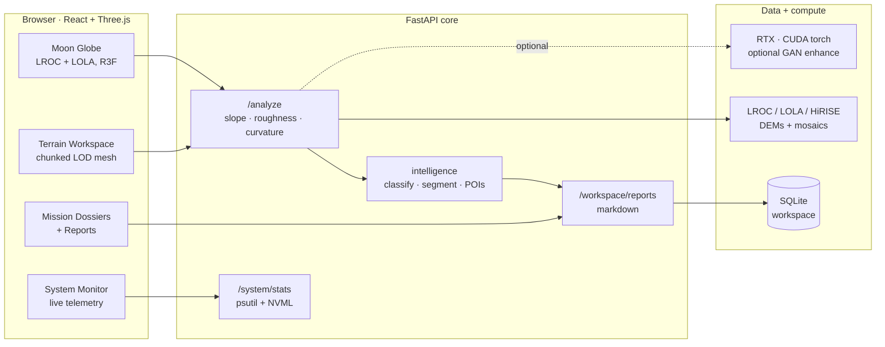
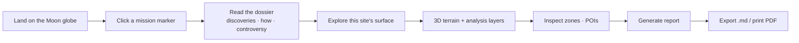
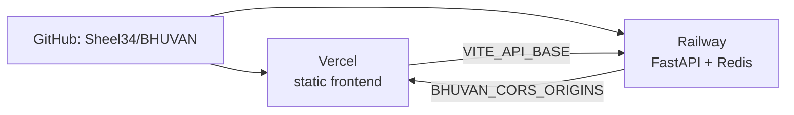

<div align="center">



<br/>

<a href="https://github.com/Sheel34/BHUVAN/actions"></a>


<br/><br/>


<br/>

<a href="#-quickstart"></a>
<a href="docs/DEPLOYMENT.md"></a>
<a href="#-the-mission-atlas"></a>

</div>

---

## What is BHUVAN

**BHUVAN** turns real lunar orbital data into a quantified, explorable surface-intelligence platform.

You open onto a photoreal Moon rendered from NASA's LROC colour mosaic and LOLA elevation. Every spot where humanity has touched the surface — Apollo, Luna, Lunokhod, Chang'e, Chandrayaan, SLIM, Beresheet — is a marker you can open for its story: who, where, when, what they found, how, and the controversies. Pick any site and BHUVAN reconstructs its terrain in 3D and runs a full analysis: elevation profile, surface classification, roughness, slope, hazard scoring, safe-zone ranking, and scientific points of interest — exported as professional reports.

It is built to feel like an instrument, not a demo: serious palette, real telemetry of your own machine, and a synchronous analysis core that produces numbers a mission planner would actually read.

<div align="center">

| | |
|---|---|
| **Hero globe** | Photoreal Moon (LROC + LOLA), drag-to-orbit, subtle mission markers |
| **Mission atlas** | 16 real surface missions with rich dossiers and controversies |
| **Terrain workspace** | 3D reconstructed patch, slope / roughness / hazard / traversability layers |
| **Intelligence** | Elevation stats, surface classification, segmentation, safe-zone ranking, POIs |
| **Reports** | Terrain Summary · Surface Analysis · Risk Assessment · Geological Overview, exportable |
| **System monitor** | Live CPU / RAM / GPU / VRAM / temp / power via NVML — closeable |

</div>

---

## ◈ System architecture



## ◈ User flow



---

## ◈ The mission atlas

Sixteen real lunar surface missions, mapped at their true touchdown coordinates and narrated.

| Mission | Agency · Country | Year | Type | Significance |
|---|---|---|---|---|
| **Apollo 11** | NASA · USA | 1969 | Crewed | First humans on another world |
| **Apollo 15** | NASA · USA | 1971 | Crewed | First rover (LRV); the Genesis Rock |
| **Apollo 17** | NASA · USA | 1972 | Crewed | Last crewed landing; orange volcanic glass |
| **Luna 2** | OKB-1 · USSR | 1959 | Impact | First object to reach the Moon |
| **Luna 9** | OKB-1 · USSR | 1966 | Lander | First soft landing + surface images |
| **Luna 16** | Lavochkin · USSR | 1970 | Sample return | First robotic sample return |
| **Luna 17 · Lunokhod 1** | Lavochkin · USSR | 1970 | Rover | First wheeled vehicle off Earth |
| **Luna 21 · Lunokhod 2** | Lavochkin · USSR | 1973 | Rover | Off-world driving record for decades |
| **Chang'e 3 · Yutu** | CNSA · China | 2013 | Rover | First soft landing in 37 years |
| **Chang'e 4 · Yutu-2** | CNSA · China | 2019 | Rover | First-ever far-side landing |
| **Chang'e 6** | CNSA · China | 2024 | Sample return | First far-side sample return |
| **Chandrayaan-3 · Vikram** | ISRO · India | 2023 | Lander | First landing near the south pole |
| **Chandrayaan-2 · Vikram** | ISRO · India | 2019 | Crash | The near-miss that inspired this tool |
| **SLIM** | JAXA · Japan | 2024 | Lander | Pinpoint landing demonstrator |
| **Beresheet** | SpaceIL · Israel | 2019 | Crash | First private lunar attempt |

---

## ◈ Tech stack

<div align="center">


<br/>


</div>

---

## ▶ Quickstart

> **Prerequisites:** Node 18+, Python 3.11+. An NVIDIA GPU is optional (used only for live telemetry and the optional GAN enhancement; the analysis core is CPU).

**Backend**

```bash
cd backend
python -m venv venv && venv/Scripts/activate      # Windows
# source venv/bin/activate                         # macOS / Linux
pip install -r requirements.txt
uvicorn main:app --reload --port 8000
```

**Frontend**

```bash
npm install
npm run dev      # http://127.0.0.1:5173
```

The globe auto-fetches NASA textures from the backend on first load; if the
backend is offline it falls back to a procedural Moon so the UI always renders.

<details>
<summary><b>Configuration (environment variables)</b></summary>

<br/>

| Variable | Purpose | Default |
|---|---|---|
| `VITE_API_BASE` | Frontend → backend URL | `http://127.0.0.1:8000` |
| `BHUVAN_CORS_ORIGINS` | Comma-separated allowed origins (prod) | dev localhost |
| `BHUVAN_WORKSPACE_DB` | SQLite path | `backend/workspace.db` |
| `BHUVAN_MOON_CACHE` | Globe texture / DEM cache | `data_cache/moon` |
| `BHUVAN_REDIS_URL` | Async job queue (optional) | local Redis |
| `BHUVAN_GAN_CHECKPOINT` | Trained terrain GAN (optional) | `backend/checkpoints/...` |

</details>

---

## ⟳ Deploy

Frontend → **Vercel**, backend → **Railway** (Redis optional). Config files
(`vercel.json`, `backend/railway.json`, `backend/Procfile`) are committed.
Full step-by-step in **[docs/DEPLOYMENT.md](docs/DEPLOYMENT.md)**.



---

## ◈ Roadmap

- [x] Photoreal Moon globe (LROC + LOLA)
- [x] 16-mission atlas with dossiers and controversies
- [x] Terrain workspace: slope / roughness / curvature / hazard / traversability
- [x] Intelligence layer + exportable reports + SQLite workspace
- [x] Live hardware telemetry (psutil + NVML)
- [x] Vercel + Railway deploy configuration
- [ ] Whole-Moon free-roam (fly out of a patch, traverse the full globe)
- [ ] Hyper-real rover / lander 3D models pinned to real sites
- [ ] Upload geo-anchoring (place an uploaded DEM at its real coordinates)
- [ ] Vehicle site-certification engine (GO / NO-GO per spacecraft spec)

---

## ◈ Data & credits

Lunar imagery and elevation: **NASA LROC** (WAC colour mosaic) and **LOLA**
(global + polar DEMs), via the NASA Scientific Visualization Studio CGI Moon
Kit and PGDA. Mission facts are historical and verifiable. This is an
educational / research visualization tool, not a flight-certified instrument.

<div align="center">
<br/>
<sub><b>BHUVAN</b> · Planetary Terrain Intelligence · built with React, Three.js, and FastAPI</sub>
</div>
